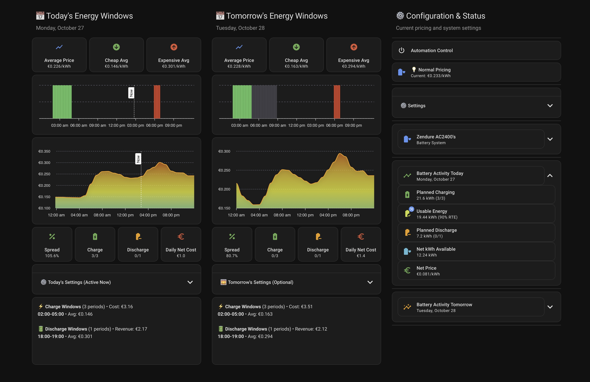

# Cheapest Energy Windows Dashboard

[](https://github.com/hacs/integration)

<a href="https://www.buymeacoffee.com/cheapest_energy_windows" target="_blank"></a>

A beautiful, comprehensive dashboard for the [Cheapest Energy Windows](https://github.com/cheapest-energy-windows/cheapest_energy_windows) Home Assistant integration.



## 🌟 Why This Dashboard?

This isn't just another energy monitoring dashboard. It's a complete control center that:

- **Zero YAML editing** - Configure everything through the UI
- **Battery Operations Linking** - Connect your battery control with simple dropdowns
- **Full Settings Control** - Every integration setting accessible from one place
- **Real-time Visualization** - See energy windows, costs, and battery status at a glance
- **Professional Features** - SOC safety indicators, notification management, quiet hours
- **Multi-vendor Support** - Works seamlessly with Nord Pool and ENTSO-E sensors

## 📋 Prerequisites

This dashboard **requires** the main Cheapest Energy Windows integration to be installed first:

1. Install the [Cheapest Energy Windows Integration](https://github.com/cheapest-energy-windows/cheapest_energy_windows) via HACS
2. Configure the integration with your price sensor (Nord Pool or ENTSO-E)

## 🚀 Installation

### Via HACS

1. Open HACS in Home Assistant
2. Click on "Frontend"
3. Click the 3 dots menu (top right) → "Custom repositories"
4. Add this repository URL: `https://github.com/cheapest-energy-windows/cheapest_energy_windows_dashboard`
5. Select category: "Dashboard"
6. Click "Add"
7. Find "Cheapest Energy Windows Dashboard" in the list and click "Download"
8. The resource will be automatically added to your Home Assistant

## 📊 Usage

### Creating the Dashboard

1. Go to **Settings → Dashboards**
2. Click **"+ Add Dashboard"** (bottom right)
3. Fill in:
   - **Title**: `Energy Windows` (or any name you prefer)
   - **Icon**: `mdi:lightning-bolt` (optional)
   - **URL**: `energy-windows` (or your preference)
   - Toggle **"Show in sidebar"** ON
4. Click **"Create"**
5. After the dashboard is created, click the **⋮ menu** (three dots) → **"Edit Dashboard"**
6. Click **⋮ menu** again → **"Raw configuration editor"**
7. Replace all content with:

```yaml
strategy:
  type: custom:dashboard-cheapest-energy-windows
views: []
```

8. Click **"Save"**
9. The dashboard will automatically load with all cards configured! ✨

## ✨ Features

### 🎯 Control Everything from One Place

The dashboard includes:

- **🔋 Battery Operations Panel** - Link automations/scripts/scenes without editing YAML
- **📅 Today's Energy Windows** - View current charge/discharge periods with pricing
- **🌅 Tomorrow's Energy Windows** - Plan ahead with tomorrow's schedules
- **⚙️ Complete Settings Control** - Adjust ALL integration settings from the dashboard:
  - Pricing windows and percentiles
  - Battery SOC safety limits
  - Time and price overrides
  - Notification preferences with quiet hours
  - Tomorrow's independent settings
- **📊 Visual Charts** - ApexCharts showing energy periods throughout the day
- **⚡ Real-time Status** - Current mode, active overrides, and battery state
- **🔔 Notification Management** - Configure which states trigger notifications
- **💰 Cost Tracking** - Financial summaries and daily cost/revenue projections
- **🛡️ SOC Protection Status** - Visual indicators when SOC safety is active

### 🤖 No YAML Editing Required

Everything can be configured through the dashboard UI:
- Link battery operations to your existing automations
- Adjust all calculation parameters
- Set time-based overrides
- Configure notifications and quiet hours
- Enable tomorrow's settings
- Monitor battery metrics and costs

## 🎨 Required Custom Cards

This dashboard uses several custom Lovelace cards. Install these via HACS Frontend:

### Required
- [Mushroom Cards](https://github.com/piitaya/lovelace-mushroom)
- [ApexCharts Card](https://github.com/RomRider/apexcharts-card)
- [Fold Entity Row](https://github.com/thomasloven/lovelace-fold-entity-row)
- [Card Mod](https://github.com/thomasloven/lovelace-card-mod)

## 🐛 Troubleshooting

### Dashboard shows "Custom element doesn't exist"
- Make sure all required custom cards are installed
- Clear your browser cache (Ctrl+Shift+R or Cmd+Shift+R)
- Verify the resource is loaded in Settings → Dashboards → Resources

### Dashboard is empty or shows errors
- Ensure the Cheapest Energy Windows integration is installed and configured
- Check that your price sensor (Nord Pool or ENTSO-E) is working and providing data
- Verify all entities from the integration exist

### Charts not showing data for ENTSO-E sensors
- Ensure the proxy sensor (`sensor.cew_price_sensor_proxy`) exists and has data
- Check that your ENTSO-E sensor provides `prices_today` and `prices_tomorrow` attributes
- Verify Docker timezone configuration if timestamps appear incorrect

### Strategy not appearing in dropdown
- Verify the resource is added as "JavaScript Module" type
- Clear browser cache and restart Home Assistant
- Check browser console for errors (F12)

## 🤝 Support

For issues specific to:
- **This dashboard**: Open an issue in this repository
- **The integration**: Visit the [main integration repository](https://github.com/cheapest-energy-windows/cheapest_energy_windows)

## 📝 License

MIT License - feel free to modify and share!

## ☕ Support the Project

If you find this dashboard useful, consider supporting the main integration developer:

[](https://www.buymeacoffee.com/cheapest_energy_windows)
